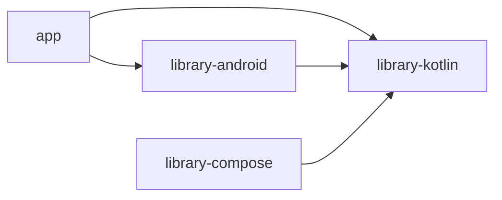

# Документация по подмодулям (Gradle)

Краткий указатель. Все пути ниже от корня **`chitalka-kotlin/`**.

**Пункты оглавления [MODULI-I-KOMPONENTY.md](../MODULI-I-KOMPONENTY.md)** (§1–§6, каждый подпункт) разобраны в [docs/moduli-detail/README.md](../moduli-detail/README.md).

**Полный перечень файлов по модулям** — [SOSTAV-VSEH-MODULEY-PUNKTAMI.md](../SOSTAV-VSEH-MODULEY-PUNKTAMI.md).

**Описание подмодулей** (расположение, роль, связи) — [submoduli/README.md](../submoduli/README.md).

## Файлы

| Модуль | Документ | Теги (кратко) |
|--------|----------|---------------|
| `app` | [app.md](app.md) | `#android-app` `#compose` `#navigation` `#reader` |
| `library-kotlin` | [library-kotlin.md](library-kotlin.md) | `#jvm` `#domain` `#i18n` `#navigation-spec` `#reader-bridge` |
| `library-android` | [library-android.md](library-android.md) | `#android-library` `#sqlite` `#epub` `#picker` |
| `library-compose` | [library-compose.md](library-compose.md) | `#template` `#compose` `#unused-by-app` |

## Граф зависимостей модулей (Gradle)

- Модуль **`app`** не зависит от **`library-compose`**.
- **`library-kotlin`** не зависит от других модулей проекта (только внешние артефакты: coroutines, serialization).

## Соглашения в документах

- В шапке каждого файла — YAML `tags` и поля `consumes` / `consumed_by` / `peers`.
- В тексте дублируются хэш-теги для быстрого поиска по репозиторию.
- «Связи» — импорты Kotlin, вызовы между composable/классами и расширения между модулями.
