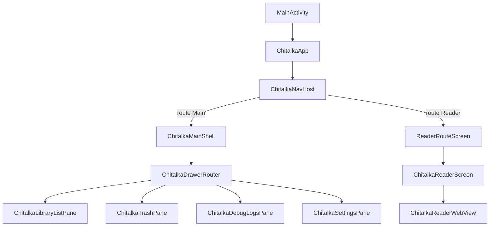

# Модуль `app`

Теги: `#android-app` `#compose` `#navigation` `#drawer` `#reader-route` `#epub-import` `#settings` `#debug-ui`

Android-приложение Chitalka: единственная точка сборки APK, весь пользовательский Compose UI, обвязка вокруг `NavHost`, drawer, панелей библиотеки и экрана читалки.

---

## Gradle и конфигурация

| Что | Путь |
|-----|------|
| Скрипт модуля | `chitalka-kotlin/app/build.gradle.kts` |
| `applicationId` / `namespace` | задаются из `chitalka-kotlin/gradle.properties` (`APP_ID`, версии) |
| ProGuard | `chitalka-kotlin/app/proguard-rules.pro` |

**Зависимости проекта:** `implementation(projects.libraryAndroid)`, `implementation(projects.libraryKotlin)` — **`library-compose` не подключён.**

Внешние ключевые библиотеки: Compose BOM, Navigation Compose, Lifecycle, Coil.

---

## Связи с другими модулями

| Направление | Суть связи |
|-------------|------------|
| → `library-kotlin` | Типы навигации (`RootStackRoutes`, `DrawerScreen`, спеки экранов, i18n/theme, мост читалки, доменные типы книг, `LibrarySessionState`, восстановление читалки `restoreLastOpenReaderIfNeeded`). |
| → `library-android` | `StorageService`, `SharedPreferencesKeyValueStore`, `EpubPickerAndroid`, `importEpubToLibrary`, `EpubService` / URI-хелперы, `ReaderNavCoordinator`, `LibrarySessionState.refreshBookCount` (расширение), `runDebugAutoLoadEpubIfNeeded`, `ChitalkaMirrorLog` (зеркало `Log` в буфер отладки); `installConsoleCapture` подключается в `Application` из `library-kotlin`. |

**Расширения из `library-android` в пакете `com.chitalka.library`:** приложение импортирует их вместе с классами из `library-kotlin` того же пакета — на classpath они объединяются (общий пакет `com.chitalka.library` / `com.chitalka.debug` и т.д.).

---

## Поток UI (высокий уровень)

---

## Иерархия composable и навигация

| Узел | Роль | Путь |
|------|------|------|
| `ChitalkaApp` | Создаёт `StorageService`, `SharedPreferencesKeyValueStore`, `LibrarySessionState`, `NavController`, координатор читалки, импорт EPUB, тему и оборачивает `ChitalkaNavHost`. | `chitalka-kotlin/app/src/main/java/com/ncorti/kotlin/template/app/ui/ChitalkaApp.kt` |
| `rememberReaderNavCoordinator` / `ReaderNavCoordinatorSideEffects` | Связка `ReaderNavCoordinator` (из `library-android`) с `NavHostController` и lifecycle. | `chitalka-kotlin/app/src/main/java/com/ncorti/kotlin/template/app/ui/ChitalkaNavigationSetup.kt` |
| `ChitalkaAppController` | Тонкая обёртка: `openReader` → координатор; `bumpLists` — инкремент nonce списков. | `chitalka-kotlin/app/src/main/java/com/ncorti/kotlin/template/app/ui/ChitalkaAppController.kt` |
| `ChitalkaNavHost` | Два маршрута: `Main` → контент shell; `Reader/{bookId}/{bookPath}` → `ReaderRouteScreen`. | `chitalka-kotlin/app/src/main/java/com/ncorti/kotlin/template/app/ui/ChitalkaNavHost.kt` |
| `AppNavRoutes` | Строки маршрутов и `navigateToReader` (encode URI). Использует `RootStackRoutes` из Kotlin-модуля. | `chitalka-kotlin/app/src/main/java/com/ncorti/kotlin/template/app/ui/AppNavRoutes.kt` |
| `ChitalkaMainShell` | `ModalNavigationDrawer`, выбор `DrawerScreen`, поиск, top bar, first-launch диалоги; передаёт контент в `ChitalkaDrawerRouter`. | `chitalka-kotlin/app/src/main/java/com/ncorti/kotlin/template/app/ui/ChitalkaMainShell.kt` |
| `ChitalkaDrawerRouter` | `when (DrawerScreen)` → конкретные панели. | `chitalka-kotlin/app/src/main/java/com/ncorti/kotlin/template/app/ui/ChitalkaDrawerRouter.kt` |

---

## Экран читалки и WebView

| Файл | Роль |
|------|------|
| `chitalka-kotlin/app/src/main/java/com/ncorti/kotlin/template/app/ui/ReaderRouteScreen.kt` | Маршрут читалки: lifecycle из `ReaderRouteLifecycle`, обновление счётчика книг. |
| `chitalka-kotlin/app/src/main/java/com/ncorti/kotlin/template/app/ui/ReaderRouteUiModel.kt` | Параметры маршрута + `persistence`, `librarySession`, `storage`. |
| `chitalka-kotlin/app/src/main/java/com/ncorti/kotlin/template/app/ui/reader/ChitalkaReaderScreen.kt` | Основной UI читалки: `ReaderScreenSpec`, `EpubService`, сохранение прогресса, мост `ReaderBridge*`. |
| `chitalka-kotlin/app/src/main/java/com/ncorti/kotlin/template/app/ui/reader/ChitalkaReaderWebView.kt` | Настройка WebView, инъекция скриптов моста, тёмная тема страницы; `WebChromeClient.onConsoleMessage` дублирует `console.*` страницы в `debugLogAppend` (вкладка отладочных логов). |
| `chitalka-kotlin/app/src/main/java/com/ncorti/kotlin/template/app/ui/reader/ReactNativeWebPolyfill.kt` | Совместимость с ожиданиями Web/RN-читалки. |

---

## Панели библиотеки, настройки, отладка

| Файл | Роль |
|------|------|
| `chitalka-kotlin/app/src/main/java/com/ncorti/kotlin/template/app/ui/library/ChitalkaLibraryListPane.kt` | Списки «сейчас читаю» / «все книги» / избранное: `StorageService`, карточка/действия из спеков Kotlin-модуля. |
| `chitalka-kotlin/app/src/main/java/com/ncorti/kotlin/template/app/ui/library/ChitalkaTrashPane.kt` | Корзина: `TrashScreenSpec`, удалённые книги. |
| `chitalka-kotlin/app/src/main/java/com/ncorti/kotlin/template/app/ui/settings/ChitalkaSettingsPane.kt` | Локаль и тема: `I18nUiState`, `persistLocale` / `persistThemeMode`. |
| `chitalka-kotlin/app/src/main/java/com/ncorti/kotlin/template/app/ui/debug/ChitalkaDebugLogsPane.kt` | Подписка на `debugLog*` из `library-kotlin`; очистка, копирование в буфер обмена (`ClipboardManager`), экспорт файла; подписи через `DebugLogsScreenSpec`. |

---

## Тема и CompositionLocal

| Файл | Роль |
|------|------|
| `chitalka-kotlin/app/src/main/java/com/ncorti/kotlin/template/app/ui/theme/ChitalkaTheme.kt` | `ChitalkaMaterialTheme`, связка с `ThemeColors` / `ThemeMode` из Kotlin-модуля. |
| `chitalka-kotlin/app/src/main/java/com/ncorti/kotlin/template/app/ui/ChitalkaCompositionLocals.kt` | `LocalChitalkaLocale`, `LocalChitalkaThemeMode`, `LocalChitalkaThemeColors`. |

---

## Точка входа процесса

| Файл | Роль |
|------|------|
| `chitalka-kotlin/app/src/main/java/com/ncorti/kotlin/template/app/ChitalkaApplication.kt` | `installConsoleCapture` (отладка). |
| `chitalka-kotlin/app/src/main/java/com/ncorti/kotlin/template/app/MainActivity.kt` | `setContent { ChitalkaApp(this) }`. |
| `chitalka-kotlin/app/src/main/AndroidManifest.xml` | Регистрация Application, Activity. |

---

## Ресурсы и тесты

| Категория | Путь |
|-----------|------|
| Ресурсы | `chitalka-kotlin/app/src/main/res/` |
| Инструментальный тест | `chitalka-kotlin/app/src/androidTest/java/com/ncorti/kotlin/template/app/MainActivityTest.kt` |

---

## Заметки по сопровождению

- Логика «что показывать в drawer» описана в `library-kotlin` (`DrawerNavigationSpec`); в `app` только отрисовка и роутинг по `DrawerScreen`.
- Любое новое подключение к БД или EPUB на уровне UI должно идти через типы из `library-android`, а строки/контракты экранов — из `library-kotlin`.
