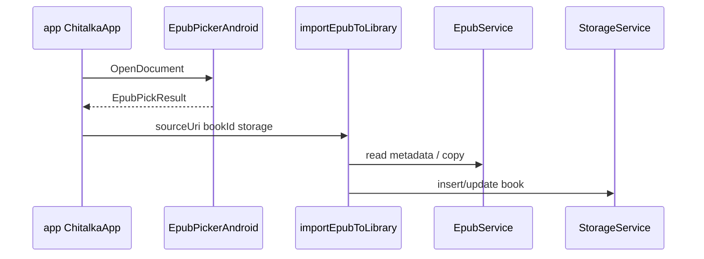

# Модуль `library-android`

Теги: `#android-library` `#storage` `#sqlite` `#epub-service` `#import-epub` `#shared-prefs` `#reader-nav` `#instrumented-test`

Платформенный слой Android: персистентность библиотеки, разбор и импорт EPUB, системный выбор файла, координация навигации в читалку, отладочные сценарии. Зависит от **`library-kotlin`** и реализует/дополняет контракты из JVM-модуля.

---

## Gradle

| Что | Путь |
|-----|------|
| Скрипт | `chitalka-kotlin/library-android/build.gradle.kts` |
| Consumer ProGuard | `chitalka-kotlin/library-android/consumer-rules.pro` |

**Зависимость проекта:** `implementation(project(":library-kotlin"))`.

---

## Связи с `library-kotlin`

| Kotlin-модуль даёт | Android-модуль использует |
|--------------------|---------------------------|
| `com.chitalka.core.types.*` | `StorageService`, `ImportEpubToLibrary` |
| `com.chitalka.library.LibraryBookLookup` | Реализуется `StorageService` |
| `com.chitalka.library.LastOpenBookPersistence` | Реализуется `SharedPreferencesKeyValueStore` |
| `com.chitalka.i18n.*` | Импорт EPUB (каталог, локаль) |
| `com.chitalka.utils.withTimeout` | `EpubService` |
| `com.chitalka.library.LibrarySessionState` | Расширение `refreshBookCount` |

**Расширения и top-level в пакете `com.chitalka.library`:** файл `LibrarySessionRefresh.kt` — `suspend fun LibrarySessionState.refreshBookCount(storage: StorageService)`; импортируется в `app` как `com.chitalka.library.refreshBookCount`.

**Пакет `com.chitalka.debug`:** `runDebugAutoLoadEpubIfNeeded` в `DebugAutoLoadEpubRunner.kt`; **`ChitalkaMirrorLog`** — обёртка над `android.util.Log`, дублирующая вывод в буфер `DebugLog` из `library-kotlin`. Не путать JVM-файл `DebugLog.kt` с Android-классами в том же префиксе пакета.

---

## Связи с `app`

| Компонент Android | Кто в `app` использует |
|---------------------|-------------------------|
| `StorageService` | `ChitalkaApp`, `ChitalkaNavHost`, панели списков, читалка, настройки. |
| `SharedPreferencesKeyValueStore` | `ChitalkaApp` как `LastOpenBookPersistence` и хранилище настроек темы/локали. |
| `EpubPickerAndroid` | `ChitalkaApp` — launcher выбора EPUB. |
| `importEpubToLibrary` | После выбора файла в `ChitalkaApp`. |
| `ReaderNavCoordinator` | `ChitalkaAppController`, `ChitalkaNavigationSetup`. |
| `runDebugAutoLoadEpubIfNeeded` | `ChitalkaApp` в `LaunchedEffect` старта. |

---

## Структура исходников (`src/main/java`)

База: `chitalka-kotlin/library-android/src/main/java/`.

### Хранилище (`com.chitalka.storage`)

| Файл | Назначение |
|------|------------|
| `com/chitalka/storage/StorageService.kt` | Класс `StorageService` + `withDb` / `withReadDb` (internal) и `mapDbException`; прогресс (`saveProgress` / `getProgress`), upsert книги (`addBook`, `upsertLibraryBook`, `setBookTotalChapters`, `setBookFavorite`), `getLibraryBook` (реализация `LibraryBookLookup`), счётчики `countLibraryBooks` / `countBooksWithProgress`. Чтения через `readableDatabase` (WAL), записи через `writableDatabase`; курсоры маппятся по ординалам. |
| `com/chitalka/storage/StorageServiceLists.kt` | Extension-функции `StorageService.list*Books` (library / recently read / favorite / trashed), `JOINED_SELECT_COLUMNS` и внутренний `queryJoined`. Вызывающие (`ChitalkaDrawerRouter`, `ChitalkaTrashPane`) импортируют их по имени. |
| `com/chitalka/storage/StorageServiceTrash.kt` | Extension-функции `moveBookToTrash` / `restoreBookFromTrash` / `purgeBook` / `clearAllData` — работают через `withDb`. |
| `com/chitalka/storage/StorageServiceMappers.kt` | `Cursor.mapLibraryBookRecordByOrdinal`, `Cursor.mapJoinedRowByOrdinal` (вычисляет `progressFraction`), `assertNonEmptyBookId` / `assertValidProgress`. |
| `com/chitalka/storage/ChitalkaSqliteOpenHelper.kt` | SQLite схема/миграции. `onConfigure` включает WAL и `PRAGMA synchronous=NORMAL`/`temp_store=MEMORY`. |
| `com/chitalka/storage/StorageServiceError.kt` | Ошибки слоя хранилища. |

### EPUB (`com.chitalka.epub`)

| Файл | Назначение |
|------|------------|
| `com/chitalka/epub/EpubService.kt` | Высокоуровневые операции с EPUB (таймауты из `library-kotlin`); разбор OPF/spine в `open()` на `Dispatchers.IO`; доменные `EpubServiceError` пробрасываются без общей обёртки. `prepareChapterBody` переписывает `` одним проходом через `StringBuilder`; регэкспы `IMG_TAG_REGEX`/`SRC_ATTR_REGEX`/`HTTP_URL_REGEX` — file-level singletons. |
| `com/chitalka/epub/EpubIo.kt` | Чтение ZIP/файлов; устойчивое UTF-8 + BOM для `container.xml` и OPF (`readOpfFromUnpackedRootFiles`). |
| `com/chitalka/epub/EpubMetadata.kt` | Обложка, автор и пр. |
| `com/chitalka/epub/EpubOpfXml.kt` | Разбор OPF. |
| `com/chitalka/epub/EpubUriUtils.kt` | URI внутри EPUB / файловая система. |
| `com/chitalka/epub/EpubTypes.kt` | Типы данных EPUB на стороне Android (I/O, контекст). |

### Импорт в библиотеку (`com.chitalka.library`)

| Файл | Назначение |
|------|------------|
| `com/chitalka/library/ImportEpubToLibrary.kt` | Копирование во внутреннее хранилище, вызов `EpubService`, запись в `StorageService`. |
| `com/chitalka/library/LibrarySessionRefresh.kt` | `LibrarySessionState.refreshBookCount`. |

### Выбор файла (`com.chitalka.picker`)

| Файл | Назначение |
|------|------------|
| `com/chitalka/picker/EpubPickerAndroid.kt` | `ActivityResultContracts`, маппинг в `EpubPickResult`. |

### Навигация (`com.chitalka.navigation`)

| Файл | Назначение |
|------|------------|
| `com/chitalka/navigation/ReaderNavCoordinator.kt` | Отложенный переход в Reader до готовности `NavHost` (аналог RN `navigationRef` + pending). |

### Настройки (`com.chitalka.prefs`)

| Файл | Назначение |
|------|------------|
| `com/chitalka/prefs/SharedPreferencesKeyValueStore.kt` | Реализация персистентности last-open и др. ключей из контрактов Kotlin-модуля. |

### Отладка (`com.chitalka.debug`)

| Файл | Назначение |
|------|------------|
| `com/chitalka/debug/DebugAutoLoadEpubRunner.kt` | `runDebugAutoLoadEpubIfNeeded` — автозагрузка EPUB в debug. |
| `com/chitalka/debug/ChitalkaMirrorLog.kt` | Зеркало `android.util.Log` → `debugLogAppend` для вкладки отладочных логов в `app`. |

### Наследие шаблона

| Файл | Назначение |
|------|------------|
| `com/ncorti/kotlin/template/library/android/ToastUtil.kt` | Утилита Toast (шаблон). |

---

## Поток данных: импорт EPUB

---

## Тесты

| Путь | Тип |
|------|-----|
| `chitalka-kotlin/library-android/src/androidTest/java/com/chitalka/storage/StorageServiceInstrumentedTest.kt` | Инструментальный. |
| `chitalka-kotlin/library-android/src/androidTest/java/com/ncorti/kotlin/template/library/android/ToastUtilTest.kt` | Шаблон. |

---

## Теги по файлам (для поиска)

`#sqlite` `#library-books` `#reading-progress` `#epub-import` `#opf` `#content-resolver` `#activity-result` `#reader-pending-nav` `#sharedpreferences` `#debug-epub-autoload`
