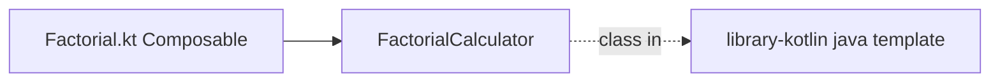

# Модуль `library-compose`

Теги: `#template` `#factorial-demo` `#material-compose-legacy` `#standalone-activity` `#unused-in-chitalka-apk`

Отдельная Android-библиотека с Compose **Material 2** и демо-компонентом из исходного Kotlin Android Template. В сборке **основного приложения Chitalka** (`module app`) **не участвует**: в `chitalka-kotlin/app/build.gradle.kts` нет `implementation(projects.libraryCompose)`.

---

## Gradle

| Что | Путь |
|-----|------|
| Скрипт | `chitalka-kotlin/library-compose/build.gradle.kts` |

**Зависимости проекта:** `implementation(projects.libraryKotlin)` — используется только **`FactorialCalculator`** из пакета шаблона.

---

## Связь с `library-kotlin`

| Файл в `library-compose` | Импорт из `library-kotlin` |
|---------------------------|------------------------------|
| `ui/components/Factorial.kt` | `com.ncorti.kotlin.template.library.FactorialCalculator` |

Путь к калькулятору в JVM-модуле: `chitalka-kotlin/library-kotlin/src/main/java/com/ncorti/kotlin/template/library/FactorialCalculator.kt`.

---

## Файлы модуля

| Файл | Назначение |
|------|------------|
| `chitalka-kotlin/library-compose/src/main/java/com/ncorti/kotlin/template/app/ComposeActivity.kt` | Отдельная `ComponentActivity` с `Scaffold` + демо. |
| `chitalka-kotlin/library-compose/src/main/java/com/ncorti/kotlin/template/app/ui/components/Factorial.kt` | Поле ввода, кнопка, анимация результата факториала. |
| `chitalka-kotlin/library-compose/src/main/AndroidManifest.xml` | Декларация активности библиотеки (если подключают к другому приложению). |
| `chitalka-kotlin/library-compose/src/androidTest/.../FactorialTest.kt` | UI-тест демо. |

Сопутствующие: `consumer-rules.pro`, `proguard-rules.pro`, `build.gradle.kts` (viewBinding включён для шаблона).

---

## Связь с `app` (отсутствует)

| Аспект | Статус |
|--------|--------|
| Gradle dependency | Нет. |
| Общий код Chitalka | `app` использует Material **3** и пакеты `com.chitalka.*`, не этот модуль. |

Если понадобится включить модуль в продукт — добавить зависимость в `app` и явно решить конфликт Material2/Material3 и дублирование тем.

---

## Теги

`#factorial` `#ComposeActivity` `#template-only` `#material2` `#optional-module`
