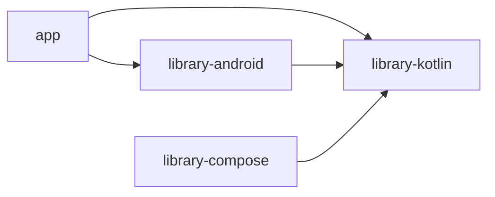

# §1. Gradle-модули (состав проекта)

Оглавление: [MODULI-I-KOMPONENTY.md §1](../MODULI-I-KOMPONENTY.md#1-gradle-модули-состав-проекта)

## Подключение

Файл: `chitalka-kotlin/settings.gradle.kts` — `include("app", "library-android", "library-compose", "library-kotlin")`.

## Таблица модулей

| Модуль | Назначение | Документация |
|--------|------------|--------------|
| **app** | APK, Compose UI, навигация, читалка | [modules/app.md](../modules/app.md), пункты §2.1–§2.5 ниже |
| **library-kotlin** | JVM-логика, спеки, мост Web | [modules/library-kotlin.md](../modules/library-kotlin.md), §3.1–§3.11 |
| **library-android** | SQLite, EPUB, picker, координатор навигации | [modules/library-android.md](../modules/library-android.md), §4.1–§4.6 |
| **library-compose** | Шаблон factorial, не в `app` | [modules/library-compose.md](../modules/library-compose.md), [§5](sec-05-library-compose.md) |

## buildSrc

| Часть | Путь | Связи |
|-------|------|--------|
| Логика сборки (не в APK) | `chitalka-kotlin/buildSrc/` | Скрипты `cleanup.gradle.kts`, `publish.gradle.kts` в `buildSrc/src/main/kotlin/` |

## Граф зависимостей (runtime-код)

`buildSrc` в граф модулей приложения не входит — подключается Gradle’ом отдельно.
