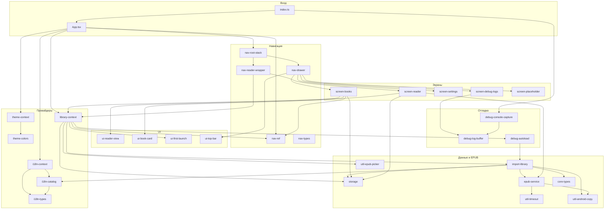

# Модули Chitalka-app (дробная карта)

Техническая документация для агентов по областям: **[docs/guides/README.md](guides/README.md)** (вход, данные, UI, i18n/тема/конфиг). **Внутренний дробный уровень:** **[docs/guides/internals/README.md](guides/internals/README.md)** — одна карточка на подфункцию/эффект/тип внутри каждого модуля.

Ниже проект разбит на **максимально мелкие** логические единицы по файлам и ролям. Связи — по **импортам TypeScript/TSX** и по **данным** (контекст, навигация, SQLite), а не по физическим пакетам npm.

---

## 1. Точка входа и оболочка приложения

| ID | Путь | Назначение |
|----|------|------------|
| `entry` | `index.ts` | `gesture-handler` → перехват консоли → `registerRootComponent(App)`. |
| `app-shell` | `App.tsx` | `SafeAreaProvider` → `ThemeProvider` → `I18nProvider` → `RootNavigator` (статус-бар, Android navigation bar, `NavigationContainer` + `LibraryProvider` + `RootStack`). |

**Зависимости:** `entry` → `app-shell` → навигация, контексты библиотеки/темы/i18n.

---

## 2. Ядро доменных типов (без логики)

| ID | Путь | Назначение |
|----|------|------------|
| `core-types` | `src/core/types.ts` | `ReadingProgress`, `LibraryBookRecord` — контракт SQLite и UI списка книг. |

**Кто импортирует:** `storage`, `import-library`, `books-screen` (и реэкспорт типов из `StorageService`).

---

## 3. Данные и EPUB (сервисный слой)

| ID | Путь | Назначение |
|----|------|------------|
| `storage` | `src/database/StorageService.ts` | SQLite (`expo-sqlite`): прогресс чтения, таблица библиотеки, миграции; ошибки `StorageServiceError`. |
| `epub-service` | `src/api/EpubService.ts` | Распаковка EPUB, spine/TOC, подготовка HTML глав, таймауты, `EpubServiceError`, константы ошибок (`EPUB_EMPTY_SPINE`, …), `readFilesystemLibraryMetadata`. |
| `util-timeout` | `src/utils/withTimeout.ts` | Обёртка таймаута для асинхронных вызовов. |
| `util-android-copy` | `src/utils/epubPipelineAndroid.ts` | `copyFileToInternalStorage` — копия во внутренний `file://` (в т.ч. с `content://`). |
| `util-epub-picker` | `src/utils/epubPicker.ts` | Документ-пикер, `deriveBookId`, `isEpubFileName`, результат `EpubPickResult`. |
| `import-library` | `src/library/importEpubToLibrary.ts` | Оркестрация: копия → `EpubService` → обложка/метаданные → запись в `StorageService`; пути `library_epubs/`, `library_covers/`. |

**Связи:**

- `epub-service` → `util-android-copy`, `util-timeout`
- `import-library` → `epub-service`, `util-android-copy`, `storage`, `core-types`, `i18n-catalog` (`bookFallbackLabels`), `react-native` Alert/FileSystem

---

## 4. Локализация (i18n)

| ID | Путь | Назначение |
|----|------|------------|
| `i18n-types` | `src/i18n/types.ts` | `AppLocale`, `APP_LOCALES`, ключ AsyncStorage. |
| `i18n-locale-ru` | `src/i18n/locales/ru.json` | Строки RU. |
| `i18n-locale-en` | `src/i18n/locales/en.json` | Строки EN. |
| `i18n-catalog` | `src/i18n/catalog.ts` | `tSync`, `bookFallbackLabels`, загрузка JSON каталогов. |
| `i18n-context` | `src/i18n/I18nContext.tsx` | `I18nProvider`, `useI18n`, персист локали в AsyncStorage. |
| `i18n-barrel` | `src/i18n/index.ts` | Публичный API пакета i18n. |

**Связи:** `i18n-context` → `i18n-catalog`, `i18n-types`; `i18n-catalog` → `i18n-types`, JSON локалей.

---

## 5. Тема

| ID | Путь | Назначение |
|----|------|------------|
| `theme-colors` | `src/theme/colors.ts` | Палитры light/dark, `getColorsForMode`. |
| `theme-context` | `src/theme/ThemeContext.tsx` | `ThemeProvider`, `useTheme`, переключение режима. |
| `theme-barrel` | `src/theme/index.ts` | Экспорт темы. |

**Связи:** `theme-context` → `theme-colors`.

---

## 6. Навигация

| ID | Путь | Назначение |
|----|------|------------|
| `nav-types` | `src/navigation/types.ts` | `DrawerParamList`, `RootStackParamList`. |
| `nav-ref` | `src/navigation/navigationRef.ts` | `navigationRef`, `navigateToReader`, `flushReaderNavigationIfPending` (очередь до готовности контейнера). |
| `nav-root-stack` | `src/navigation/RootStack.tsx` | Native stack: `Main` (drawer) + `Reader`. |
| `nav-drawer` | `src/navigation/AppDrawer.tsx` | Drawer: экраны-заглушки, «Книги и документы», настройки, логи; header = `AppTopBar`. |
| `nav-reader-wrapper` | `src/navigation/ReaderScreenWrapper.tsx` | Связка роут-параметров с `ReaderScreen` + `useLibrary` (обновление счётчика при уходе). |

**Связи:** `nav-ref` → `nav-types`; `nav-root-stack` → `nav-drawer`, `nav-reader-wrapper`, `nav-types`; `nav-drawer` → экраны, `app-top-bar`, `i18n`, `theme`; `nav-reader-wrapper` → `reader-screen`, `library-context`, `nav-types`.

---

## 7. Состояние библиотеки (React)

| ID | Путь | Назначение |
|----|------|------------|
| `library-context` | `src/context/LibraryContext.tsx` | Счётчик книг, `libraryEpoch`, импорт с тулбара/приветствия, навигация в читалку/в раздел книг, модалка первого запуска. |

**Связи:** → `first-launch-modal`, `debug-autoload`, `storage`, `i18n`, `import-library`, `util-epub-picker`, `nav-ref`.

---

## 8. UI-компоненты

| ID | Путь | Назначение |
|----|------|------------|
| `ui-reader-view` | `src/components/ReaderView.tsx` | WebView + postMessage скролла, debounce для автосохранения. |
| `ui-book-card` | `src/components/BookCard.tsx` | Карточка книги в списке. |
| `ui-first-launch` | `src/components/FirstLaunchModal.tsx` | Модалка пустой библиотеки / первого запуска. |
| `ui-top-bar` | `src/components/AppTopBar.tsx` | Шапка drawer: меню, заголовок, поиск → `openBooksForSearch`. |

**Связи:** `ui-reader-view` — без импортов проектных модулей (только RN + WebView). Остальные → `theme`, `i18n`; `ui-top-bar` → `library-context`.

---

## 9. Экраны

| ID | Путь | Назначение |
|----|------|------------|
| `screen-placeholder` | `src/screens/PlaceholderScreen.tsx` | Заглушка для пунктов drawer без контента. |
| `screen-books` | `src/screens/BooksAndDocsScreen.tsx` | Список книг из SQLite, FAB импорта, открытие читалки. |
| `screen-reader` | `src/screens/ReaderScreen.tsx` | Загрузка структуры EPUB, глава, прогресс, ошибки/таймауты, встраивание `ReaderView`. |
| `screen-settings` | `src/screens/SettingsScreen.tsx` | Тема, язык, версия (`expo-constants`). |
| `screen-debug-logs` | `src/screens/DebugLogsScreen.tsx` | Просмотр буфера логов, экспорт/sharing. |
| `screen-library-legacy` | `src/screens/LibraryScreen.tsx` | Отдельный экран выбора EPUB (сейчас **нигде не подключён** к `AppDrawer` / `RootStack` — модуль на будущее или внешняя вставка). |

**Связи:**

- `screen-books` → `ui-book-card`, `library-context`, `i18n`, `core-types`, `storage`, `nav-ref`, `theme`, safe-area
- `screen-reader` → `epub-service`, `ui-reader-view`, `storage`, `i18n`, FileSystem
- `screen-settings` → `i18n`, `theme`, constants
- `screen-debug-logs` → `debug-log-buffer`, `i18n`, `theme`, FileSystem, Sharing
- `screen-placeholder` → `theme`
- `nav-drawer` внутренние обёртки (`ReadingNowScreen`, …) → `screen-placeholder` + `i18n`

---

## 10. Отладка

| ID | Путь | Назначение |
|----|------|------------|
| `debug-log-buffer` | `src/debug/DebugLog.ts` | Кольцевой буфер записей лога, подписки, экспорт. |
| `debug-console-capture` | `src/debug/installConsoleCapture.ts` | Перехват `console.*` → `debug-log-buffer`. |
| `debug-autoload` | `src/debug/debugAutoLoadEpub.ts` | В __DEV__: автoимпорт bundled EPUB через `import-library`. |
| `debug-epub-asset-types` | `src/debug/epub-asset.d.ts` | Типизация импорта `.epub` из ассетов. |
| `asset-debug-epub` | `assets/debug/ebook.demo.epub` | Демо-файл для автозагрузки. |

**Связи:** `entry` → `debug-console-capture`; `library-context` → `debug-autoload`; `debug-autoload` → `import-library`, `storage`, `expo-asset`, bundled epub; `debug-console-capture` → `debug-log-buffer`; `screen-debug-logs` → `debug-log-buffer`.

---

## 11. Конфигурация репозитория (не runtime-модули кода, но «модули» продукта)

| ID | Путь | Назначение |
|----|------|------------|
| `cfg-app-json` | `app.json` | Expo: имя, иконки, splash, плагины. |
| `cfg-package` | `package.json` | Зависимости и скрипты. |
| `cfg-metro` | `metro.config.js` | Сборка JS. |
| `cfg-eas` | `eas.json` | Профили EAS Build/Submit. |
| `cfg-ts` | `tsconfig.json` | TypeScript. |
| `scripts-android-licenses` | `scripts/accept-android-licenses-and-sdk.ps1` | Вспомогательный скрипт окружения Android SDK. |

---

## 12. Сводная схема связей (Mermaid)

Направление стрелки: **A → B** означает «A зависит от B / вызывает B».

---

## 13. Матрица «кто от кого» (кратко)

| Модуль | Основные входящие зависимости |
|--------|-------------------------------|
| `app-shell` | theme, i18n, nav-ref, library-context, RootStack, expo StatusBar/NavigationBar |
| `library-context` | storage, import-library, epub-picker, nav-ref, i18n, first-launch, debug-autoload |
| `import-library` | epub-service, android-copy, storage, core-types, i18n catalog |
| `epub-service` | android-copy, withTimeout, FileSystem, zip |
| `nav-drawer` | screens, AppTopBar, theme, i18n |
| `nav-reader-wrapper` | ReaderScreen, library-context |
| `ReaderScreen` | EpubService, ReaderView, StorageService, i18n |
| `BooksAndDocsScreen` | BookCard, StorageService, library-context, navigationRef, theme, i18n |

---

## 14. Внешние границы (npm / Expo)

Ключевые мосты из кода приложения: **`expo-sqlite`**, **`expo-file-system/legacy`**, **`expo-document-picker`**, **`react-native-webview`**, **`react-native-zip-archive`**, **`@react-navigation/*`**, **`AsyncStorage`**, **`expo-asset`**, **`expo-sharing`**, **`expo-constants`**. Их не дублируем как внутренние модули — это **зависимости** перечисленных выше единиц.

---

## 15. Внутренний уровень (ещё мельче)

Каждый логический модуль из таблиц §1–11 дополнительно разбит на **внутренние единицы** (отдельная функция, эффект, тип, файл конфигурации): описание и связи — в каталоге **[`docs/guides/internals/README.md`](guides/internals/README.md)** (81 карточка + индекс).

---

*Файл отражает состояние исходников на момент генерации; при добавлении файлов обновляйте таблицы и диаграмму.*
