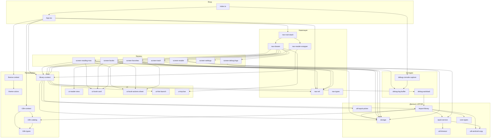

# Модули Chitalka-app (дробная карта)

Техническая документация для агентов по областям: **[docs/guides/README.md](guides/README.md)** (вход, данные, UI, i18n/тема/конфиг). **Внутренний дробный уровень:** **[docs/guides/internals/README.md](guides/internals/README.md)** — одна карточка на подфункцию/эффект/тип внутри каждого модуля.

Ниже проект разбит на **максимально мелкие** логические единицы по файлам и ролям. Связи — по **импортам TypeScript/TSX** и по **данным** (контекст, навигация, SQLite), а не по физическим пакетам npm.

---

## 1. Точка входа и оболочка приложения

| ID | Путь | Назначение |
|----|------|------------|
| `entry` | `index.ts` | `gesture-handler` → перехват консоли → **`react-native-screens`**: `enableScreens(true)`, `enableFreeze(true)` → `registerRootComponent(App)`. |
| `app-shell` | `App.tsx` | `SafeAreaProvider` → `ThemeProvider` → `I18nProvider` → `RootNavigator` (статус-бар, Android navigation bar с отложенным `setButtonStyleAsync` через rAF + cleanup, `NavigationContainer` + `LibraryProvider` + `RootStack`). |

**Зависимости:** `entry` → `app-shell` → навигация, контексты библиотеки/темы/i18n.

---

## 2. Ядро доменных типов (без логики)

| ID | Путь | Назначение |
|----|------|------------|
| `core-types` | `src/core/types.ts` | `ReadingProgress`; `LibraryBookRecord` (контракт SQLite: `totalChapters`, `isFavorite`, `deletedAt` для soft-delete); `LibraryBookWithProgress` — запись библиотеки + доля прогресса для списков. |

**Кто импортирует:** `storage`, `import-library`, экраны библиотеки (и реэкспорт типов из `StorageService`).

---

## 3. Данные и EPUB (сервисный слой)

| ID | Путь | Назначение |
|----|------|------------|
| `storage` | `src/database/StorageService.ts` | SQLite (`expo-sqlite`): прогресс; таблица `library_books` с `total_chapters`, `is_favorite`, `deleted_at` (корзина); выборки `listLibraryBooks`, `listRecentlyReadBooks`, `listFavoriteBooks`, `listTrashedBooks`; `setBookFavorite`, `moveBookToTrash`, `restoreBookFromTrash`, `purgeBook`, `setBookTotalChapters`; миграции: `PRAGMA table_info` + кэш имён колонок перед идемпотентными `ALTER`, затем индекс по `deleted_at`; ошибки `StorageServiceError`. |
| `epub-service` | `src/api/EpubService.ts` | Распаковка EPUB, spine/TOC, подготовка HTML глав, таймауты, `EpubServiceError`, константы ошибок (`EPUB_EMPTY_SPINE`, …), `readFilesystemLibraryMetadata`. |
| `util-timeout` | `src/utils/withTimeout.ts` | Обёртка таймаута для асинхронных вызовов. |
| `util-android-copy` | `src/utils/epubPipelineAndroid.ts` | `copyFileToInternalStorage` — копия во внутренний `file://` (в т.ч. с `content://`). |
| `util-epub-picker` | `src/utils/epubPicker.ts` | Документ-пикер, `deriveBookId`, `isEpubFileName`, результат `EpubPickResult`. |
| `import-library` | `src/library/importEpubToLibrary.ts` | Оркестрация: копия → `EpubService` → обложка/метаданные → запись в `StorageService`; пути `library_epubs/`, `library_covers/`; повторный импорт того же `bookId` может снять soft-delete (`deleted_at`) через upsert. |

**Связи:**

- `epub-service` → `util-android-copy`, `util-timeout`
- `import-library` → `epub-service`, `util-android-copy`, `storage`, `core-types`, `i18n-catalog` (`bookFallbackLabels`), `react-native` Alert/FileSystem

---

## 4. Локализация (i18n)

| ID | Путь | Назначение |
|----|------|------------|
| `i18n-types` | `src/i18n/types.ts` | `AppLocale`, `APP_LOCALES`, ключ AsyncStorage. |
| `i18n-locale-ru` | `src/i18n/locales/ru.json` | Строки RU. |
| `i18n-locale-en` | `src/i18n/locales/en.json` | Строки EN. |
| `i18n-catalog` | `src/i18n/catalog.ts` | `tSync`, `bookFallbackLabels`, загрузка JSON каталогов. |
| `i18n-context` | `src/i18n/I18nContext.tsx` | `I18nProvider`, `useI18n`, персист локали в AsyncStorage. |
| `i18n-barrel` | `src/i18n/index.ts` | Публичный API пакета i18n. |

**Связи:** `i18n-context` → `i18n-catalog`, `i18n-types`; `i18n-catalog` → `i18n-types`, JSON локалей.

---

## 5. Тема

| ID | Путь | Назначение |
|----|------|------------|
| `theme-colors` | `src/theme/colors.ts` | Палитры light/dark, `getColorsForMode`. |
| `theme-context` | `src/theme/ThemeContext.tsx` | `ThemeProvider`, `useTheme`, переключение режима; `colors` = `getColorsForMode(mode)` без лишнего `useMemo` (палитры статичны в `colors.ts`); режим в AsyncStorage (`chitalka_theme_mode`). |
| `theme-barrel` | `src/theme/index.ts` | Экспорт темы. |

**Связи:** `theme-context` → `theme-colors`.

---

## 6. Навигация

| ID | Путь | Назначение |
|----|------|------------|
| `nav-types` | `src/navigation/types.ts` | `DrawerParamList`, `RootStackParamList`. |
| `nav-ref` | `src/navigation/navigationRef.ts` | `navigationRef`, `navigateToReader`, `flushReaderNavigationIfPending` (очередь до готовности контейнера). |
| `nav-root-stack` | `src/navigation/RootStack.tsx` | Native stack: `Main` (drawer) + `Reader`. |
| `nav-drawer` | `src/navigation/AppDrawer.tsx` | Drawer без заглушек: `ReadingNow`, `BooksAndDocs`, `Favorites`, `Cart` (экран корзины `TrashScreen`), `DebugLogs`, `Settings`; подписи через i18n `drawer.*`; header = `AppTopBar`. |
| `nav-reader-wrapper` | `src/navigation/ReaderScreenWrapper.tsx` | Связка роут-параметров с `ReaderScreen` + `useLibrary` (обновление счётчика при уходе). |

**Связи:** `nav-ref` → `nav-types`; `nav-root-stack` → `nav-drawer`, `nav-reader-wrapper`, `nav-types`; `nav-drawer` → `screen-reading-now`, `screen-books`, `screen-favorites`, `screen-trash`, `screen-debug-logs`, `screen-settings`, `ui-top-bar`, `i18n`, `theme`; `nav-reader-wrapper` → `reader-screen`, `library-context`, `nav-types`.

---

## 7. Состояние библиотеки (React)

| ID | Путь | Назначение |
|----|------|------------|
| `library-context` | `src/context/LibraryContext.tsx` | Счётчик книг, `storageReady`, `libraryEpoch`, `bumpLibraryEpoch` / `refreshBookCount`, импорт EPUB с тулбара/приветствия, переход в читалку после импорта, состояние поиска (`isSearchOpen`, `searchQuery`, `openSearch` / `closeSearch` / `setSearchQuery`), модалка первого запуска; автооткрытие последней читаемой книги на старте через `lastOpenBook`; **без** API избранного/корзины (это экраны + `StorageService`). |
| `library-last-open-book` | `src/library/lastOpenBook.ts` | AsyncStorage-ключ `chitalka_last_open_book_id`: `setLastOpenBookId` / `getLastOpenBookId` / `clearLastOpenBookId`. Выставляется `ReaderScreenWrapper` при монтировании, очищается при возврате в библиотеку; используется `library-context` для автооткрытия книги на следующем запуске. |

**Связи:** `library-context` → `first-launch-modal`, `debug-autoload`, `storage`, `i18n`, `import-library`, `util-epub-picker`, `nav-ref`, `library-last-open-book`; `nav-reader-wrapper` → `library-last-open-book`.

---

## 8. UI-компоненты

| ID | Путь | Назначение |
|----|------|------------|
| `ui-reader-view` | `src/components/ReaderView.tsx` | WebView (`key={chapterKey}`, `androidLayerType="hardware"`): мост JSON — `scroll` (debounce ~350 ms на RN), `page` с полем **`dir`**: `"prev"` \| `"next"` → `onRequestPageChange`, **`ready`** → `onContentReady`; после `onLoadEnd` — инжект начального скролла и два `requestAnimationFrame` в странице перед `ready` (см. комментарий в коде про paint и анимацию). |
| `ui-book-card` | `src/components/BookCard.tsx` | Карточка: обложка или **fallback-макет** на месте обложки (заголовок/автор, акцентная полоса), рамка `hairline`; опционально полоса `progress` 0..1, бейдж избранного, `onPress` / `onLongPress`. Размер файла в UI **не** показывается. |
| `ui-book-actions-sheet` | `src/components/BookActionsSheet.tsx` | Нижний лист действий с книгой (`Modal` + анимация): список `BookActionItem`, обложка/метаданные. |
| `ui-first-launch` | `src/components/FirstLaunchModal.tsx` | Модалка пустой библиотеки / первого запуска. |
| `ui-top-bar` | `src/components/AppTopBar.tsx` | Шапка drawer: меню, заголовок, кнопка поиска (лупа); по нажатию → `openSearch`, шапка превращается в поле ввода `TextInput` (`searchQuery` → `setSearchQuery`), слева `arrow-back` = `closeSearch`, справа `close` очищает запрос. Скрывается на экранах `Settings` и `DebugLogs` (через `route.name`); для непустых экранов со списком книг лупа показывается при `bookCount > 0`. |

**Связи:** `ui-reader-view` — без импортов проектных модулей (только RN + WebView). Остальные → `theme`, `i18n`; `ui-book-actions-sheet` → `theme`, `i18n`; `ui-top-bar` → `library-context`.

---

## 9. Экраны

| ID | Путь | Назначение |
|----|------|------------|
| `screen-reading-now` | `src/screens/ReadingNowScreen.tsx` | Недавно читаемые (`listRecentlyReadBooks`); `BookActionsSheet` по long press (избранное, корзина). |
| `screen-books` | `src/screens/BooksAndDocsScreen.tsx` | Список активных книг; `BookActionsSheet` по long press; FAB импорта; открытие читалки. |
| `screen-favorites` | `src/screens/FavoritesScreen.tsx` | Избранное; `BookActionsSheet` по long press (снять избранное, корзина + `refreshBookCount`). |
| `screen-trash` | `src/screens/TrashScreen.tsx` | Корзина (`listTrashedBooks`): восстановление, окончательное удаление (`purgeBook`). |
| `screen-reader` | `src/screens/ReaderScreen.tsx` | EPUB + spine; **два буферных слоя** WebView (`layerA` / `layerB`, `activeLayerId`): при смене главы неактивный слой получает HTML, ждёт `onContentReady`, затем **перекрёстная анимация** (`Animated`, ~500 ms, opacity/translate + лёгкие «шейды»); жесты только у активного слоя; прогресс и `goChapter` привязаны к `activeLayer.chapterIndex`. |
| `screen-settings` | `src/screens/SettingsScreen.tsx` | Тема (`Switch` + `setMode`); язык — `Modal` + якорь `measureInWindow`, список без затемнения, стык с полем, **`FadeInUp`** для появления меню; версия (`expo-constants`). |
| `screen-debug-logs` | `src/screens/DebugLogsScreen.tsx` | Просмотр буфера логов, экспорт/sharing. |
| `screen-library-legacy` | `src/screens/LibraryScreen.tsx` | Отдельный экран выбора EPUB (сейчас **нигде не подключён** к `AppDrawer` / `RootStack` — модуль на будущее или внешняя вставка). |

**Связи:**

- `screen-reading-now`, `screen-books`, `screen-favorites` → `ui-book-card`, `ui-book-actions-sheet`, `storage`, `i18n`, `nav-ref`, `theme`, safe-area
- `screen-trash` → `storage`, `library-context` (`libraryEpoch`, `bumpLibraryEpoch`, `refreshBookCount`), `i18n`, `theme`, FileSystem (удаление файлов при purge), safe-area; свой UI строки списка (не `BookCard`)
- `screen-reader` → `epub-service`, `ui-reader-view`, `storage`, `i18n`, FileSystem
- `screen-settings` → `i18n`, `theme`, `react-native-reanimated`, `expo-constants`, `Dimensions` / `Modal` / `Pressable`
- `screen-debug-logs` → `debug-log-buffer`, `i18n`, `theme`, FileSystem, Sharing
- `nav-drawer` → перечисленные экраны drawer + `ui-top-bar`

---

## 10. Отладка

| ID | Путь | Назначение |
|----|------|------------|
| `debug-log-buffer` | `src/debug/DebugLog.ts` | Кольцевой буфер записей лога, подписки, экспорт. |
| `debug-console-capture` | `src/debug/installConsoleCapture.ts` | Перехват `console.*` → `debug-log-buffer`. |
| `debug-autoload` | `src/debug/debugAutoLoadEpub.ts` | В __DEV__: автoимпорт bundled EPUB через `import-library`. |
| `debug-epub-asset-types` | `src/debug/epub-asset.d.ts` | Типизация импорта `.epub` из ассетов. |
| `debug-readme` | `src/debug/README.md` | Человекочитаемое описание отладочных сценариев (dev). |
| `asset-debug-epub` | `assets/debug/ebook.demo.epub` | Демо-файл для автозагрузки. |

**Связи:** `entry` → `debug-console-capture`; `library-context` → `debug-autoload`; `debug-autoload` → `import-library`, `storage`, `expo-asset`, bundled epub; `debug-console-capture` → `debug-log-buffer`; `screen-debug-logs` → `debug-log-buffer`; `debug-readme` — только документация в репозитории.

---

## 11. Конфигурация репозитория (не runtime-модули кода, но «модули» продукта)

| ID | Путь | Назначение |
|----|------|------------|
| `cfg-app-json` | `app.json` | Expo: имя, иконки, splash, плагины. |
| `cfg-package` | `package.json` | Зависимости и скрипты. |
| `cfg-metro` | `metro.config.js` | Сборка JS. |
| `cfg-eas` | `eas.json` | Профили EAS Build/Submit. |
| `cfg-ts` | `tsconfig.json` | TypeScript. |
| `scripts-android-licenses` | `scripts/accept-android-licenses-and-sdk.ps1` | Вспомогательный скрипт окружения Android SDK. |

---

## 12. Сводная схема связей (Mermaid)

Направление стрелки: **A → B** означает «A зависит от B / вызывает B».

---

## 13. Матрица «кто от кого» (кратко)

| Модуль | Основные входящие зависимости |
|--------|-------------------------------|
| `app-shell` | theme, i18n, nav-ref, library-context, RootStack, expo StatusBar/NavigationBar |
| `library-context` | storage, import-library, epub-picker, nav-ref, i18n, first-launch, debug-autoload |
| `import-library` | epub-service, android-copy, storage, core-types, i18n catalog |
| `epub-service` | android-copy, withTimeout, FileSystem, zip |
| `nav-drawer` | ReadingNow/Books/Favorites/Trash/Debug/Settings screens, AppTopBar, theme, i18n |
| `nav-reader-wrapper` | ReaderScreen, library-context |
| `ReaderScreen` | EpubService, ReaderView (×2 при переходе), RN Animated, StorageService, i18n |
| `ReadingNowScreen` | BookCard, BookActionsSheet, StorageService, library-context, navigationRef, theme, i18n |
| `BooksAndDocsScreen` | BookCard, BookActionsSheet, StorageService, library-context, navigationRef, theme, i18n |
| `FavoritesScreen` | BookCard, BookActionsSheet, StorageService, library-context, navigationRef, theme, i18n |
| `TrashScreen` | StorageService, library-context, theme, i18n, FileSystem |
| `SettingsScreen` | theme, i18n, expo-constants, react-native-reanimated, Modal/Dimensions/Pressable |

---

## 14. Внешние границы (npm / Expo)

Ключевые мосты из кода приложения: **`expo-sqlite`**, **`expo-file-system/legacy`**, **`expo-document-picker`**, **`react-native-webview`**, **`react-native-zip-archive`**, **`@react-navigation/*`**, **`react-native-screens`** (`enableScreens` / `enableFreeze` в `index.ts`), **`AsyncStorage`**, **`expo-asset`**, **`expo-sharing`**, **`expo-constants`**, API **`Animated` / `Easing`** из **`react-native`** (перелистывание глав в `ReaderScreen`), **`react-native-reanimated`** (анимации на `SettingsScreen`). Их не дублируем как внутренние модули — это **зависимости** перечисленных выше единиц.

---

## 15. Внутренний уровень (ещё мельче)

Каждый логический модуль из таблиц §1–11 дополнительно разбит на **внутренние единицы** (отдельная функция, эффект, тип, файл конфигурации): описание и связи — в каталоге **[`docs/guides/internals/README.md`](guides/internals/README.md)** (индекс карточек; при появлении новых экранов и API хранилища дополняйте карточки и строки в оглавлении).

---

*Файл отражает текущее состояние `src/` в рабочей копии (в т.ч. `enableScreens`/`enableFreeze`, правки `App.tsx`/`ThemeContext`/`SettingsScreen`, ридер и библиотека). При коммитах обновляйте таблицы, mermaid и `guides/internals/`.*
