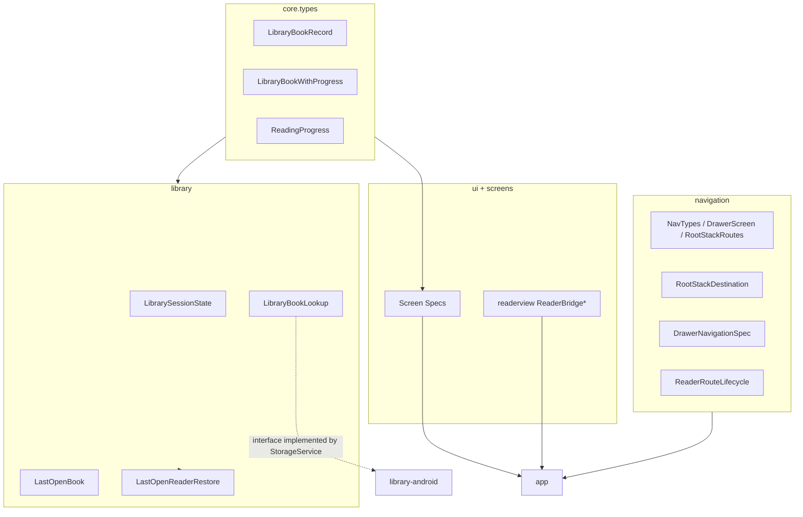

# Модуль `library-kotlin`

Теги: `#jvm` `#no-android-sdk` `#domain` `#screens-spec` `#navigation` `#readerview-bridge` `#i18n` `#theme` `#debug-log`

Общая JVM/Kotlin-библиотека без Android API: модели библиотеки, контракты экранов (спеки), навигационные типы, JS/HTML мост для WebView-читалки, локализация и тема, утилиты. Публикуется как `java-library` с toolchain 17.

---

## Gradle

| Что | Путь |
|-----|------|
| Скрипт | `chitalka-kotlin/library-kotlin/build.gradle.kts` |

**Внешние зависимости:** `kotlinx-serialization-json`, `kotlinx-coroutines-core`. **Модулей проекта не импортирует** — в частности, **нет** `StorageService` и других Android-классов: они передаются снаружи как параметры или через интерфейсы (`LibraryBookLookup` реализует `StorageService` в `library-android`).

---

## Связи с другими модулями

| Модуль | Связь |
|--------|--------|
| **`app`** | Импортирует пакеты `com.chitalka.*` для UI, навигации и моста читалки. |
| **`library-android`** | Импортирует типы ядра (`core.types`), `LibraryBookLookup`, `EpubErrorCodes`, `WithTimeout`, i18n, каталог строк и т.д. Реализует интерфейсы/расширяет классы, ожидаемые сигнатурами из этого модуля. |
| **`library-compose`** | Только демо `FactorialCalculator` из пакета шаблона `com.ncorti.kotlin.template.library`. |

**Важно:** интерфейс `LastOpenBookPersistence` и сущности в `com.chitalka.library` определены здесь; **Android-реализация** персистентности — в `library-android` (`SharedPreferencesKeyValueStore`), но пакет при сборке `app` совпадает по префиксу с другими `com.chitalka.*` из Android-модуля — следить за дубликатами имён типов в одном пакете.

---

## Внутренние слои (логическая карта)

---

## Пакеты и файлы (`src/main`)

Пути от `chitalka-kotlin/library-kotlin/src/main/`.

### `com.chitalka.core.types` — доменные записи

| Файл | Назначение |
|------|------------|
| `kotlin/com/chitalka/core/types/LibraryBookRecord.kt` | Запись книги в библиотеке. |
| `kotlin/com/chitalka/core/types/LibraryBookWithProgress.kt` | Композиция: `record: LibraryBookRecord` + `lastChapterIndex: Int?` + `progressFraction: Double?`. Поля книги читаются через `book.record.title` и т.п. — без дублирования. |
| `kotlin/com/chitalka/core/types/ReadingProgress.kt` | Модель прогресса: глава, смещение скролла, макс. прокрутка по главе. |

### `com.chitalka.navigation`

| Файл | Назначение |
|------|------------|
| `kotlin/com/chitalka/navigation/NavTypes.kt` | `DrawerScreen`, `RootStackRoutes`, `ReaderRouteParams`. |
| `kotlin/com/chitalka/navigation/RootStackDestination.kt` | Sealed-иерархия корневого стека (Main / Reader). |
| `kotlin/com/chitalka/navigation/DrawerNavigationSpec.kt` | Порядок и метки drawer (i18n-пути). |
| `kotlin/com/chitalka/navigation/ReaderRouteLifecycle.kt` | События жизненного цода маршрута читалки (обновление счётчиков и т.п. — через колбэки). |

### `com.chitalka.library`

| Файл | Назначение |
|------|------------|
| `kotlin/com/chitalka/library/LibrarySessionState.kt` | Состояние сессии библиотеки (счётчики, поиск, welcome-флаги). |
| `kotlin/com/chitalka/library/LibraryBookLookup.kt` | Интерфейс поиска книги по id (реализация в `StorageService`). |
| `kotlin/com/chitalka/library/LastOpenBook.kt` | Ключи и операции last-open book id. |
| `kotlin/com/chitalka/library/LastOpenReaderRestore.kt` | `suspend fun restoreLastOpenReaderIfNeeded` — восстановление читалки при старте. |
| `kotlin/com/chitalka/library/LibraryListProgressFraction.kt` | Доля прочитанного для списка библиотеки: глава + прокрутка внутри главы. |

### `com.chitalka.screens.*` — спецификации экранов (контракты для Compose в `app`)

| Пакет / файл | Экран |
|--------------|--------|
| `screens/common/BookListScreenSpec.kt` | Единый контракт «Сейчас читаю» / «Книги и документы» / «Избранное» — `data class BookListScreenSpec` с фабриками `ReadingNow`, `BooksAndDocs`, `Favorites` (различия только в i18n-ключе пустого состояния и наличии FAB). |
| `screens/trash/TrashScreenSpec.kt` | Корзина. |
| `screens/settings/SettingsScreenSpec.kt` | Настройки. |
| `screens/debuglogs/DebugLogsScreenSpec.kt` | Отладочные логи: заголовки, подписи кнопок (очистить / **скопировать** / экспорт), экспорт. |
| `screens/reader/ReaderScreenSpec.kt` | Читалка: `object ReaderScreenSpec` с типами (`ReaderLayerId`, `ReaderLayerState`, `ReaderOpenErrorKind`), вложенными константами (`I18nKeys`, `Timing`, `Transition`, `Layout`, `Colors`, `EMPTY_READER_HTML`) и i18n-аксессорами (`backToLibrary` / `loading` / `errorTitle` / `backToBooks` / `chapterProgressLabel` / `pageIndicatorSlash`). |
| `screens/reader/ReaderScreenSpecErrors.kt` | Extension `ReaderScreenSpec.readerOpenErrorMessage(locale, ReaderOpenErrorKind)` + private `epubOpenErrorMessage` (маппинг `EPUB_*` кодов на `ERR_*` строки каталога). |
| `screens/reader/ReaderScreenSpecChapter.kt` | Extensions для логики глав: `clampChapterIndex`, `inactiveLayerId`, `normalizeSavedScrollOffset`, `layerHtmlForWebView`, `webViewBaseUrl`, `shouldWarnUnpackedOutsideDocuments`, `layerToken`, `transitionDirectionSign`, `targetChapterForPageTurn`, `canAttemptChapterChange`, `shouldSkipChapterNavigation`, `transitionDistancePx`. |
| `screens/reader/ReaderScreenSpecTransitions.kt` | Extensions для математики анимации: `outgoingPageTranslateXPx`, `incomingPageTranslateXPx`, `piecewiseLinear`, `outgoingPageOpacity`, `incomingPageOpacity`, `outgoingShadeOpacity`, `incomingShadeOpacity`. |
| `screens/common/BookListScreenLayout.kt` | Общая раскладка списка. |
| `screens/common/BookListSearchFilter.kt` | Нормализация поискового запроса. |

### `com.chitalka.ui.*`

| Файл | Назначение |
|------|------------|
| `ui/readerview/ReaderBridgeScripts.kt` | JS для моста WebView ↔ натив. |
| `ui/readerview/ReaderBridgeMessages.kt` | Парсинг/типы сообщений моста. |
| `ui/readerview/ReaderDarkModeHtml.kt` | Вставка стилей тёмной темы в HTML. |
| `ui/readerview/ReaderPageDirection.kt` | Направление страниц (LTR/RTL). |
| `ui/bookcard/BookCardSpec.kt` | Контракт карточки книги. |
| `ui/bookactions/BookActionsSheetSpec.kt` | Действия с книгой (лист). |
| `ui/topbar/AppTopBarSpec.kt` | Верхняя панель. |
| `ui/firstlaunch/FirstLaunchModalSpec.kt` | Первый запуск / пустая библиотека. |

### `com.chitalka.i18n` / `com.chitalka.theme`

| Файл | Назначение |
|------|------------|
| `i18n/I18nTypes.kt`, `I18nCatalog.kt` | Локали и строки. |
| `i18n/I18nPreferences.kt` | `I18nUiState`, чтение/запись предпочтений локали (функции `persistLocale`, `loadPersistedLocale` — используются из `app`). |
| `theme/ThemeColors.kt`, `ThemePreferences.kt` | Палитра и режим темы, `ThemeUiState`, персист. |

### `com.chitalka.picker`

| Файл | Назначение |
|------|------------|
| `picker/EpubPickResult.kt` | Результат выбора файла ( sealed / Ok / Error / Canceled). |
| `picker/EpubPickerUtils.kt` | Чистые утилиты разбора URI (без `Activity`). |

### `com.chitalka.epub`

| Файл | Назначение |
|------|------------|
| `epub/EpubErrorCodes.kt` | Общие коды ошибок EPUB для UI. |

### `com.chitalka.storage`

| Файл | Назначение |
|------|------------|
| `storage/StorageErrorCodes.kt` | Стабильные коды ошибок слоя хранилища (`STORAGE_ERR_*`). Не локализованы — это контракт. |
| `storage/StorageErrorMessages.kt` | Маппинг кодов на локализованные строки через `I18nCatalog` (`storage.errors.*`). |

### `com.chitalka.debug` / `com.chitalka.utils`

| Файл | Назначение |
|------|------------|
| `debug/DebugLog.kt` | Кольцевой буфер отладочных записей. |
| `debug/InstallConsoleCapture.kt` | Перехват **stdout/stderr** в буфер (не `android.util.Log`; зеркало `Log` — в `library-android`, см. модуль `library-android`). |
| `debug/DebugAutoLoadEpub.kt` | Правила/флаги автозагрузки (данные; runner в Android-модуле). |
| `utils/WithTimeout.kt` | Таймаут для suspend-операций (используется в `EpubService` на Android). |

### Наследие шаблона

| Файл | Назначение |
|------|------------|
| `java/com/ncorti/kotlin/template/library/FactorialCalculator.kt` | Демо для `library-compose`, не часть домена Chitalka. |

---

## Тесты

Корень: `chitalka-kotlin/library-kotlin/src/test/kotlin/` — зеркалирование пакетов `com.chitalka.*` с суффиксом `*Test.kt`. Дополнительно: `src/test/java/.../FactorialCalculatorTest.kt`.

---

## Теги по областям (для поиска)

`#core-types` `#navigation` `#drawer-screen` `#reader-params` `#library-session` `#last-open-restore` `#screen-spec` `#reader-bridge` `#i18n-catalog` `#theme-mode` `#epub-errors` `#debug-log` `#picker-utils`
